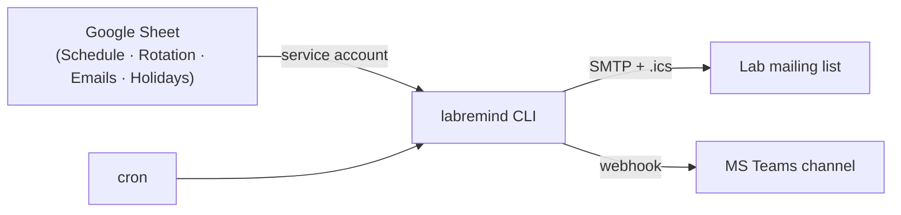

# Lab Meeting Reminders

Automated reminders for recurring lab meetings. A Google Sheet contains the schedule of events (lab meetings); a cron job reads it and sends calendar invites (SMTP + iCalendar) and Microsoft Teams notifications.

## How it works



The spreadsheet is deliberately the user interface: anyone in the lab can edit the schedule with no training, and there is nothing to host albeit initial setup is a bit time consuming.

## Quickstart

```bash
pip install -r requirements.txt
cp example_config.cfg cal_config.cfg   # fill in your values (gitignored)
cp .env.example .env                   # add EMAIL_USER / EMAIL_PASSWORD (gitignored)
```

Share the spreadsheet with the service account in `autocreds`, then:

```bash
python -m labremind generate-schedule --dry-run   # preview schedule rows
python -m labremind invite --dry-run              # preview next invite
python -m labremind teams --dry-run               # preview Teams message
```

## Setup

### Google service account

The tool reads the spreadsheet through a service account (no interactive OAuth):

0. Create a google account for the lab if you don't already have one. 
1. In the [Google Cloud Console](https://console.cloud.google.com/), create a project and enable the **Google Sheets API** and **Google Drive API**.
2. Create a service account (**IAM & Admin → Service Accounts**), add a JSON key, and download it (e.g. as `serviceaccount-lab.json` - make sure it is gitignored, never commit it).
3. Share the spreadsheet with the service account's email address as **Editor**. You can also create a view-only shareable link to share with your lab, so labmember with/without gmail accounts can view the full spreadsheet.
4. Point `autocreds` in `cal_config.cfg` at the downloaded JSON file.

### Teams workflow (Power Automate)

`labremind teams` POSTs a JSON payload to a Power Automate webhook (`[teams] mode = workflow`):

    {"title": "Upcoming Lab Meeting Schedule", "message_list": "<br>-joined HTML lines", "sender": "...", "date_sent": "2026-09-19"}

Build the flow — two blocks:

1. Trigger: **When a Teams webhook request is received** (Teams connector).
2. Action: **Post message in a chat or channel** 
<br> Post as *User*, Post in *Channel*, pick the team/channel, and set the message to the expressions `triggerBody()?['title']` and `triggerBody()?['message_list']` (add via the Expression tab so they become `fx` tokens, not plain text).
3. Save, turn the flow on, and copy the trigger's **HTTP POST URL** into `webhookUrl` in `cal_config.cfg`.

Notes: the URL contains a `sig` secret; treat it like a password (it lives in gitignored config). Teams strips custom font colors, so holiday lines render as plain text.


## Commands

| Command | Does |
|---|---|
| `labremind invite [--auto] [--force] [--dry-run]` | Send an iCalendar invite for the next event, or a "no meeting" email for holidays. `--auto` (cron mode) only acts on the event `days_ahead` days out. Already-notified events are skipped unless `--force`. |
| `labremind teams [--dry-run]` | Post the next `maxevents` meetings to Teams. |
| `labremind generate-schedule [--limit N] [--dry-run]` | Generate schedule rows from the rotation (3 Data → 1 Journal Club, skipping holiday Thursdays) and append them to the Schedule sheet. |

Example cron (weekly invite + Teams digest):

```cron
0 12 * * 4 cd /path/to/labremind && python -m labremind invite --auto >> invite.log 2>&1
0 12 * * 4 cd /path/to/labremind && python -m labremind teams >> teams.log 2>&1
```

## Design decisions

- **SMTP + app password instead of Google OAuth.** Google's OAuth2 flows assume an interactive user (2FA, token refresh UX); that is unsustainable for an unattended bot. A service account reads the Sheets, an app password sends the mail.
- **Power Automate webhooks over classic connector cards.** Microsoft retired Office 365 connector webhooks, so the Teams notifier defaults to a Power Automate `workflow` payload (`[teams] mode = card` keeps the old pymsteams path).
- **Idempotent sends.** Sent events are recorded in `.labremind_state.json`, so a double-fired cron job never sends duplicate invites.
- **Pure schedule planner.** The rotation/holiday logic in `labremind/schedule.py` takes plain data and returns rows — no API calls — so it is fully unit-tested (`pytest`).

## Migrating from the old scripts

The repo previously had one script per approach. They are consolidated into the CLI:

| Old script | Replacement |
|---|---|
| `cal_invite.py` (Google API + OAuth) | retired — OAuth was unsustainable for a bot |
| `cal_invite_no_oauth2.py` | `labremind invite` |
| `cal_invite_no_oauth_batch.py` | `labremind invite` with `batch_size` in config |
| `msteams_remind.py` | `labremind teams` with `[teams] mode = card` |
| `msteams_notify.py` | `labremind teams` (default `mode = workflow`) |
| `generate_schedule.py` | superseded |
| `add_events_from_rotation.py` | `labremind generate-schedule` |
| `helper_scripts/` | removed — no OAuth tokens to manage anymore |

## Future directions

- Greedy rotation optimizer: balance presentation counts instead of a fixed rotation (with a fair offset for new lab members); counts would likely be recorded in Rotation spreadsheet.
- Absence handling: auto-cancel and re-plan when someone is out.
